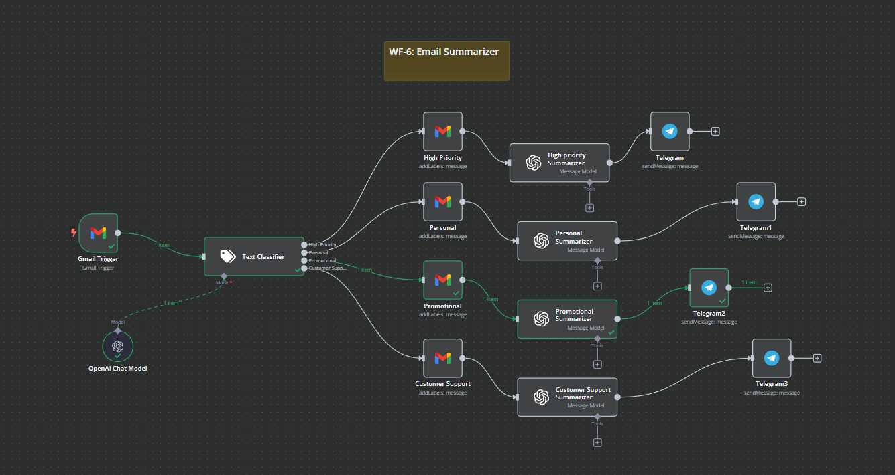

# WF-6: Gmail Email Categorization Agent – n8n Workflow

## 📌 Overview
This **n8n workflow**, `WF-6: Gmail Email Categorization Agent`, automates the classification of incoming Gmail emails into four categories: High Priority, Personal, Promotional, and Customer Support. It then sends the categorized email summaries to a Telegram chat for immediate action.

## 🔧 Workflow Components
### 🏗️ Core Modules
1. **📧 Gmail Trigger** – Triggers the workflow every minute and retrieves new emails from Gmail.
2. **🤖 Text Classifier** – Uses AI to classify the emails into categories such as High Priority, Personal, Promotional, and Customer Support based on their content.
3. **📝 High Priority Summarizer** – Summarizes high priority emails using OpenAI's GPT model.
4. **📝 Personal Summarizer** – Summarizes personal emails using OpenAI's GPT model.
5. **📝 Promotional Summarizer** – Summarizes promotional emails using OpenAI's GPT model.
6. **📝 Customer Support Summarizer** – Summarizes customer support emails using OpenAI's GPT model.
7. **📱 Telegram** – Sends categorized email summaries to a Telegram chat.

## ⚙️ How It Works
1. 📧 **Gmail Trigger** monitors incoming Gmail emails every minute.
2. 🤖 The **Text Classifier** analyzes the email content and classifies it into one of the four categories: High Priority, Personal, Promotional, or Customer Support.
3. 📝 Based on the classification, the corresponding **Summarizer** (High Priority, Personal, Promotional, or Customer Support) uses OpenAI’s GPT model to generate a summary of the email.
4. 📱 The **Telegram** nodes send the summarized email content to a Telegram chat for further review and action.

## 📷 Workflow Screenshot

## 🚀 Setup Instructions
- 📥 **Import the workflow** into `n8n`.
- 🔑 **Ensure API credentials** for Gmail, OpenAI, and Telegram are configured.
- ✅ **Activate the workflow** to start classifying and summarizing incoming emails.

## 📝 Notes
- ⚠️ The workflow is **inactive by default**.
- 🛠️ Customize the email categorization criteria and Telegram chat ID as per your requirements.
